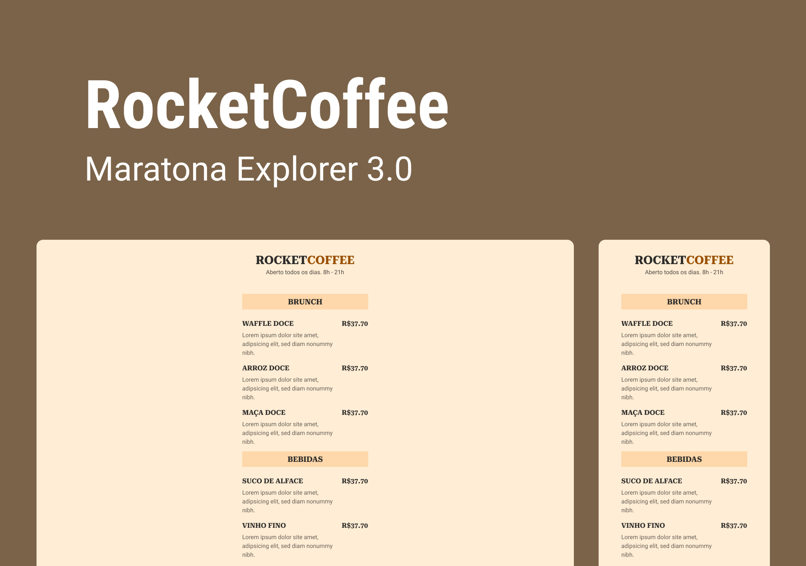

# Rocket Coffee

<div align="center">
    
</div>

---

## 🚀 Tecnologias

- HTML
- CSS
- [Node.js](https://nodejs.org/en/)
- [Typescript](https://www.typescriptlang.org/)
- [Express](https://expressjs.com/pt-br/)
- [EJS](https://ejs.co/)

---

## 🎨 Utilitários

- [Google Fonts](https://fonts.google.com/)

---

## ⚙ Ferramentas e Dependências

- [EJS](https://www.npmjs.com/package/ejs)
- [Typescript](https://www.npmjs.com/package/typescript)
- [Rimraf](https://www.npmjs.com/package/rimraf)
- [TS-Node-Dev](https://www.npmjs.com/package/ts-node-dev)
- [Express](https://www.npmjs.com/package/express)
- [@Types/Express](https://www.npmjs.com/package/@types/express)

**Não esqueça de instalar as dependências acima**

---

## 💻 Projeto

O Rocket Cofee é um projeto referente à Projeto desenvolvido durante a Maratona Explorer 3.0, da Rocketseat, desenvolvida inicialmente com HTML e CSS, e implementada pelo Desenvolvedor.

## 🖥 Acesse o Projeto Local

### ✅ Requisitos

Antes de tudo, você precisa ter o [Git](https://git-scm.com/) e o [Node.js](https://nodejs.org/en/) instalados.

### 🏁 Começo

````bash
# Clone o projeto
git clone https://github.com/Gustavo-Nasc/Rocket-Coffee

# Acesse a pasta do Projeto
cd Rocket-Coffee/

# Instale as dependências
npm install

# Execute o projeto (Em ambiente de Desenvolvimento)
npm run dev

# O servidor será inicializado e poderá ser acessado pela porta 3000 no Localhost
# localhost:3000
````